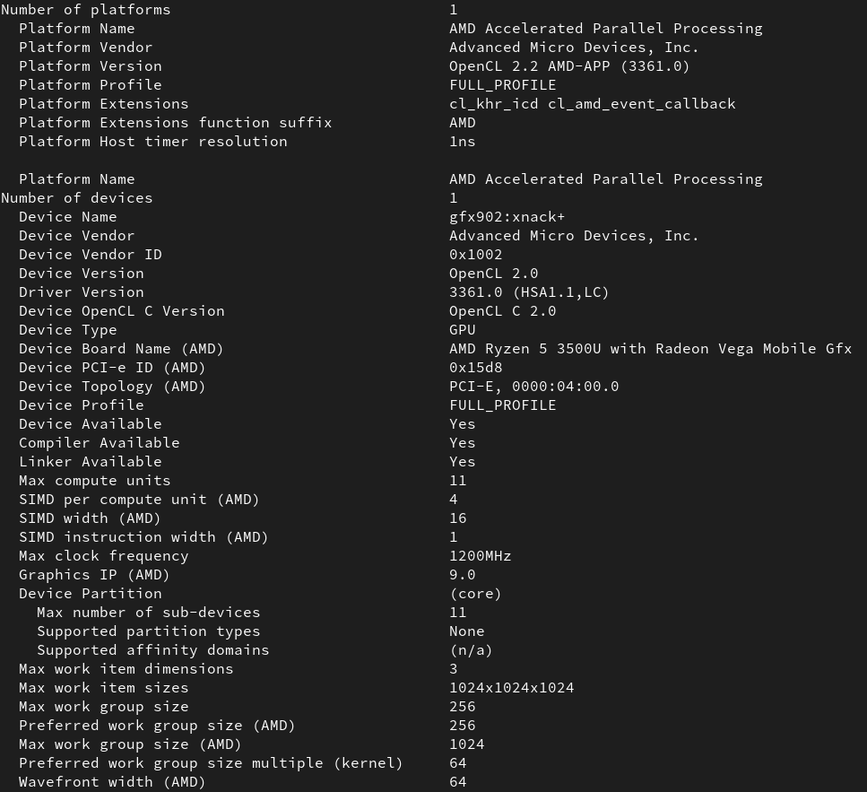
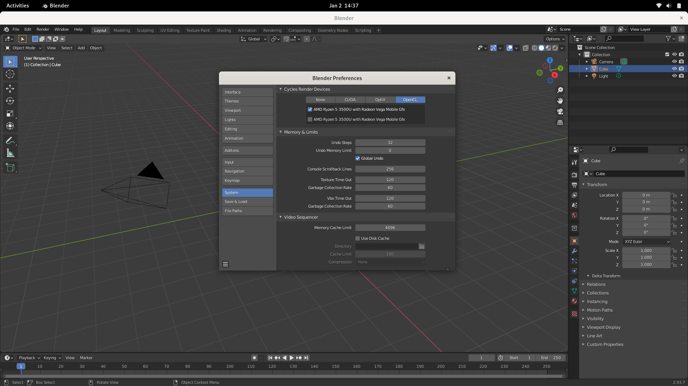

# OpenCL-AMD-Fedora

OpenCL userspace driver as provided in the amdgpu-pro driver stack. This package is intended to work along with the free amdgpu stack for Fedora Workstation (unlikely to work on Silverblue). Similiar to https://aur.archlinux.org/packages/opencl-amd/

Other functionality includes `Portable-ProGL`, a portable configuration of the proprietary OpenGL stack from `amdgpu-pro`. This allows the system to retain the standard, better performing free openGL stack, while also allowing users to configure applications to use the `amdgpu-pro` version of OpenGL.

`Patch-Davinci-Resolve` will patch Davinci Resolve to use `Portable-ProGL`, as well as fix an audio delay bug by installing `alsa-plugins-pulseaudio` if it's not already installed. If your only goal is to run Resolve, this function is pretty much your one-click (one keyboard press?) solution for the woes that come with Resolve + an AMD GPU on Fedora.

`Install-HIP-Latest` will install the latest version of HIP (Heterogeneous-Compute Interface for Portability). Somewhat experimental with this script.

## Installation

```
git clone https://github.com/sukhmeetbawa/OpenCL-AMD-Fedora.git
cd ./OpenCL-AMD-Fedora
./opencl-amd.sh
```
## Usage 

The script will prompt you to select which portions of the program you want to use.


## Explanation of all functionality
### `Install-OpenCL-Latest`
Compatible with Vega GPUs and newer. Automatically adds repositories and dependencies. 

### `Install-OpenCL-Legacy`
Compatible with Arctic Islands/Polaris. Installs the last version of the driver compatible with these GPUs (21.30 targeting RHEL 8.4). Yeah, I couldn't believe AMD would make 3 year old GPU obsolete either. The future is now. Automatically installs a local repository on the system. Remote dependencies are added automatically.

### `Portable-ProGL` 
After installation, drivers will be located at `$HOME/.amdgpu-progl-portable`.

### `Patch-Davinci-Resolve` 
First installs `Portable-ProGL` automatically. The script will then edit the launch arguments of the .desktop file located at `/usr/share/applications/com.blackmagicdesign.resolve.desktop`. A backup will be created in the same directory, labeled `com.blackmagicdesign.resolve.desktop.bak`. 

### `Install-HIP-Latest`
Installs the latest version of HIP (Heterogeneous-Compute Interface for Portability). Somewhat experimental with this script.

### `Uninstall-OpenCL`
Removes either version of OpenCL installed with this script - latest or legacy. Removes repositories added by this script. Note: if mesa OpenCL was previously uninstalled by this script, it will NOT be reinstalled. For new users, this will NOT affect the bootability of your system.

### `Uninstall-ProGL`
Uninstalls `Portable-ProGL` from `$HOME`. The script will check if Davinci Resolve has been patched, and if so, it will restore the default configuration. The uninstallation will then remove the drivers in the user's `$HOME` directory.


## Other

In the future, automatic patching of the `.bashrc` file to provide a `proGL ()` function is possible. Keep in mind, you do/will still need to edit the .desktop files or executable arguments for whatever program you are/will be using. If you know this is something you want to do, you can manually add this to your `.bashrc` file to more easily use `Portable-ProGL` with other applications as follows:

```
progl () 
{
	export LD_LIBRARY_PATH="/home/$USER/.amdgpu-progl-portable/opt/amdgpu-pro/lib64:${LD_LIBRARY_PATH}"
	export LIBGL_DRIVERS_PATH="/home/$USER/.amdgpu-progl-portable/usr/lib64/dri/"
	export dri_driver="amdgpu"
}

```

## Screenshots

Screenshots that opencl is succesfully installed.

### clinfo

### Blender 2.93 LTS


## Credits
https://github.com/Koppajin

https://www.reddit.com/r/Fedora/comments/m2il41/guide_installing_opencl_alongside_mesa_drivers/

https://www.reddit.com/r/Fedora/comments/nprppu/guide_workaround_to_install_amdgpupro_opencl/

https://github.com/GloriousEggroll/rpm-amdgpu-pro-opencl
